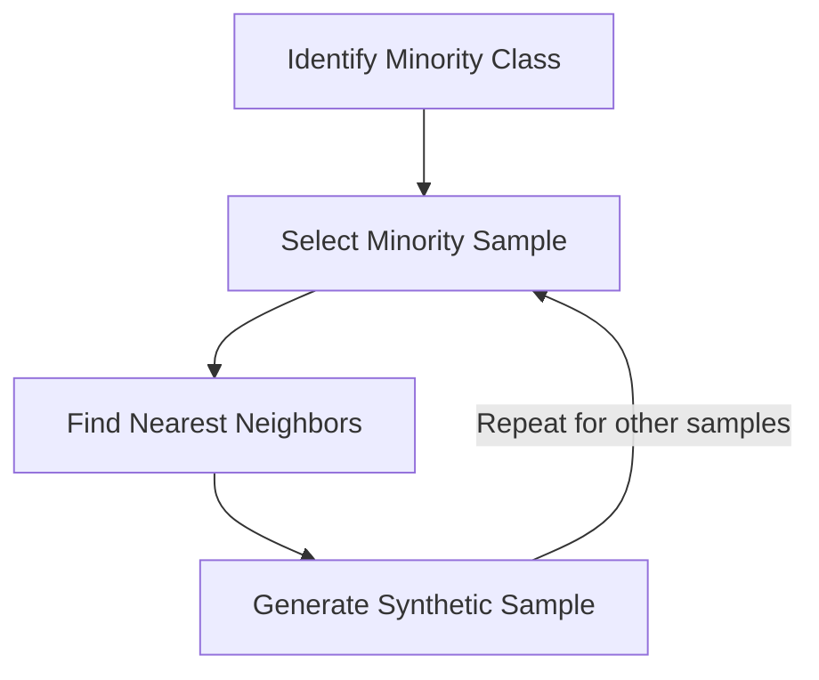

## Introduction

In many real-world classification problems, the distribution of [[concepts/machine learning/Classes|classes]] in the dataset is often imbalanced, meaning that one class has significantly more instances than the other class(es). This imbalance can pose challenges for [[Machine Learning (ML)|machine learning]] models, as they tend to be biased towards the majority class, leading to poor performance on the minority class(es). One popular technique to address this issue is Synthetic Minority Over-sampling Technique (SMOTE).

## What is SMOTE?

<mark style="background: #FFF3A3A6;">SMOTE is a statistical technique for increasing the number of instances in the minority class by creating synthetic examples.</mark> It works by selecting examples from the minority class and introducing synthetic examples along the line segments joining any/all of the k minority class nearest neighbors. By increasing the number of instances in the minority class, SMOTE aims to balance the class distribution and improve the performance of the classifier on the minority class.

## How SMOTE Works

The SMOTE algorithm follows these steps:

1. **Identify the minority class**: First, the algorithm identifies the minority class in the dataset.

2. **Compute [[K-Nearest Neighbor Algorithm|k-nearest neighbors]]**: For each instance in the minority class, the algorithm computes its k-nearest neighbors from the same class.

3. **Create synthetic instances**: For each instance in the minority class, the algorithm creates synthetic instances by randomly selecting one of its k-nearest neighbors and generating a new instance along the line segment joining the two instances.

4. **Combine original and synthetic instances**: The original minority instances are combined with the synthetic instances to create a new, balanced dataset.

The number of synthetic instances created depends on the desired balance between the majority and minority classes.



## Video lesson

[SMOTE - Handle imbalanced dataset | Synthetic Minority Oversampling Technique | Machine Learning (youtube.com)](https://www.youtube.com/watch?v=adHqzek--d0)

## Example Implementation in Python

Here's an example implementation of SMOTE using the `imbalanced-learn` library in Python:

```python
from collections import Counter
from sklearn.datasets import make_classification
from imblearn.over_sampling import SMOTE
import numpy as np

# Generate an imbalanced dataset
X, y = make_classification(n_samples=1000, weights=[0.9, 0.1], random_state=42)

# Print the class distribution
print("Original dataset shape:", Counter(y))

# Apply SMOTE
smote = SMOTE()
X_resampled, y_resampled = smote.fit_resample(X, y)

# Print the new class distribution
print("Resampled dataset shape:", Counter(y_resampled))
```

In this example, we first generate an imbalanced dataset using `make_classification` from scikit-learn. We then apply SMOTE using the `SMOTE` class from `imbalanced-learn`. The `fit_resample` method takes the input features `X` and target labels `y` and returns the resampled features `X_resampled` and labels `y_resampled`.

## Advantages and Disadvantages

**Advantages**:

- SMOTE is an effective technique for addressing class imbalance and improving the performance of classifiers on minority classes.
- It is a simple and easy-to-implement technique.
- SMOTE generates synthetic instances based on the feature space, rather than creating duplicates or random instances.

**Disadvantages**:

- SMOTE can increase the overlapping between classes, making the classification task more difficult.
- It may introduce noise in the data, especially when the minority class instances are already scattered.
- SMOTE assumes that the minority class instances are surrounded by instances from the same class, which may not always be the case.

## Variations and Extensions

Several variations and extensions of SMOTE have been proposed to address its limitations:

- **Borderline-SMOTE**: This variation focuses on generating synthetic instances near the decision boundary, as these instances are more likely to be misclassified.
- **Adaptive Synthetic (ADASYN)**: ADASYN adaptively generates synthetic instances based on the distribution of the minority class instances, focusing more on instances that are harder to learn.
- **SMOTE-ENN**: This approach combines SMOTE with Edited Nearest Neighbor (ENN) to remove instances from both majority and minority classes that are misclassified by their nearest neighbors.

## Conclusion

SMOTE is a powerful technique for handling imbalanced datasets in classification problems. By generating synthetic instances for the minority class, it aims to balance the class distribution and improve the performance of classifiers on the minority class. However, it's important to consider the potential drawbacks and explore variations or extensions of SMOTE to address specific challenges in your dataset.